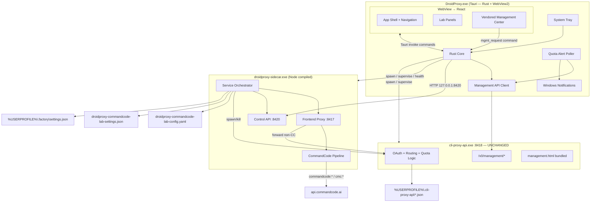
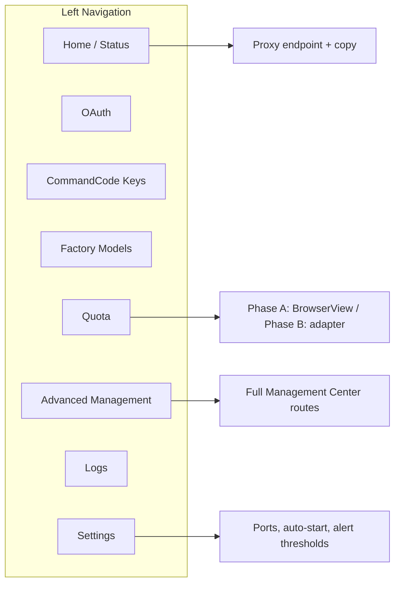
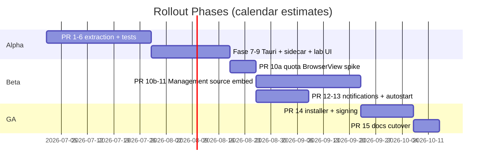

# DroidProxy Windows Desktop Application — Technical Design

| Field | Value |
|-------|-------|
| **Author** | DroidProxy Team |
| **Date** | 2026-06-29 |
| **Status** | Draft (rev. 2 — Tauri + sidecar) |
| **Repo** | `droidproxy-commandcode-lab` |
| **Design ID** | `0f21a773` |

---

## Overview

Today, `droidproxy-commandcode-lab` runs three cooperating services inside a single Node.js process (`src/cli.js`, ~1,924 lines): a public OpenAI-compatible frontend proxy (`0.0.0.0:8417`), a local `cli-proxy-api.exe` backend (`127.0.0.1:8418`), and a lightweight HTML dashboard (`0.0.0.0:8419`). Quota management and advanced provider configuration live in a separate browser tab at `http://127.0.0.1:8418/management.html` (bundled from [Cli-Proxy-API-Management-Center](https://github.com/router-for-me/Cli-Proxy-API-Management-Center)).

This design proposes a **native Windows desktop application** that:

1. Preserves **all** current lab behavior (proxy routing, CommandCode conversion, Factory model application, OAuth triggers, config generation).
2. Embeds **quota management** (and progressively the full Management Center) without opening an external browser.
3. **Modularizes** the `cli.js` monolith into testable packages.
4. Adds Windows-native affordances: **system tray**, **auto-start**, and **quota alert notifications**.

The recommended stack is **Tauri 2 + Node sidecar + React**, keeping the full proxy stack (`:8417`, CommandCode, Factory, OAuth) in a compiled Node sidecar while the Tauri shell (Rust + WebView2) provides a lightweight control UI, tray, and notifications. **`cli-proxy-api.exe` is unchanged.**

---

## Background & Motivation

### Current state

```
npm start
  └── node src/cli.js start
        ├── spawn resources/bin/cli-proxy-api.exe  → 127.0.0.1:8418
        ├── http.createServer (frontend proxy)     → 0.0.0.0:8417
        └── http.createServer (dashboard)          → 0.0.0.0:8419
```

| Component | Location | Responsibility |
|-----------|----------|----------------|
| Monolith entry | `src/cli.js` | CLI, process lifecycle, proxy, dashboard REST, Factory models, settings |
| Dashboard UI | `dashboard/index.html`, `dashboard/app.js` (~305 lines) | Status, OAuth buttons, CommandCode keys, Factory models, logs |
| Backend binary | `resources/bin/cli-proxy-api.exe` | OAuth token storage, round-robin routing, Management API |
| Generated config | `resources/config.template.yaml` → `%USERPROFILE%\.cli-proxy-api\droidproxy-commandcode-lab-config.yaml` | Backend port, management secret, routing, quota-exceeded policy |
| App settings | `%USERPROFILE%\.cli-proxy-api\droidproxy-commandcode-lab-settings.json` | `managementSecretKey`, `commandCodeApiKeys`, `factoryModelIds` |

### Pain points

| Pain point | Severity | Detail |
|------------|----------|--------|
| Split UX | **High** | Users must open `management.html` in a browser for quota; lab dashboard is a separate origin (`:8419` vs `:8418`). |
| Monolithic `cli.js` | **High** | Proxy, CommandCode (~400 lines), Factory catalog (~250 lines), dashboard API, and process management are intertwined; no unit tests. |
| No background operation | **Medium** | Closing the terminal kills all services; no tray/minimize-to-background workflow. |
| No proactive quota alerts | **Medium** | Quota must be manually refreshed in Management Center. |
| Secret handling | **Medium** | Management key is returned in plaintext via `GET /api/config` to the dashboard. |
| LAN exposure | **Low–Medium** | Dashboard and proxy default to `0.0.0.0`; acceptable for lab but risky without explicit opt-in in a desktop product. |

### Why now

The bundled `cli-proxy-api.exe` already ships Management Center ≥ 7.1.0 with a mature **Quota Management** page. The upstream UI fetches quota via the Management API (`/v0/management`) using `POST /api-call` to proxy provider-specific quota endpoints per auth file — logic we should **consume**, not reimplement.

---

## Goals & Non-Goals

### Goals

- Single Windows desktop app replacing `npm start` + browser dashboard + external `management.html`.
- **CLI parity** with current lab proxy behavior: same default ports (8417/8418/8419), env vars, CommandCode routing, Claude beta rewrite, Gemini path rewrite, and GPT fast mode when using `npm start` or the desktop app's CLI-equivalent settings.
- **Desktop app bind default:** frontend proxy listens on **`127.0.0.1:8417`** unless the user enables **"Allow LAN access"** in Settings (`allowLanAccess: true` → `0.0.0.0`, matching lab LAN sharing). This is an intentional desktop-only deviation from CLI defaults.
- **Quota management in-app** for Claude, Antigravity, Codex, Kimi, xAI (matching upstream `QuotaPage.tsx`).
- Tray icon with service status; optional **start with Windows**.
- **Desktop notifications** when quota crosses configurable thresholds.
- Modular codebase with clear package boundaries and regression tests for CommandCode conversion.
- Incremental migration: CLI/`npm start` remain working until cutover release.

### Non-Goals (v1)

- macOS/Linux ports (Windows-only is acceptable).
- Reimplementing Management API or provider quota protocols in the proxy layer.
- Replacing `cli-proxy-api.exe` with a different backend.
- Remote management (`allow-remote: true`) — backend stays `127.0.0.1`-only.
- Auto-update of `cli-proxy-api.exe` (manual/bundled upgrade in v1).
- Rewriting all Management Center pages in a new design system in v1 — vendored UI is acceptable.

---

## Proposed Design

### High-level architecture



### Technology stack selection

| Option | Pros | Cons | Verdict |
|--------|------|------|---------|
| **Tauri 2 + Node sidecar** | Small shell (~8–15 MB); WebView2 (system); RAM ~80–150 MB idle; **includes full stack** via sidecar; `cli-proxy-api.exe` untouched | Two child processes to supervise (sidecar + backend); sidecar packaging (`pkg`/`bun compile`) | **Recommended** |
| Electron | Single Node main process; simplest spawn model | ~150–200 MB install; Chromium RAM ~200–400 MB; heavy for a control app | Rejected (user preference: too heavy) |
| Tauri only (no sidecar) | Smallest binary | Requires rewriting ~1,500 lines of Node proxy/CommandCode in Rust | Rejected |
| WPF / WinUI 3 | Native Windows UX | Full UI + proxy rewrite in C# | Rejected |

**Decision: Tauri 2 + Vite + React 19 + `droidproxy-sidecar.exe` (Node compiled from `@droidproxy/*`).**

#### What runs where (full functionality)

| Capability | Host | Notes |
|------------|------|-------|
| Proxy `:8417`, CommandCode, rewrites, Factory apply | **Node sidecar** | Extracted from `src/cli.js`; same logic as today |
| Spawn `cli-proxy-api.exe`, OAuth login children | **Node sidecar** | Same `LOGIN_FLAGS` spawn args |
| Control API (accounts, models, logs, keys) | **Node sidecar** `:8420` | Replaces `:8419` dashboard REST; loopback only |
| Tray, notifications, auto-start, window | **Tauri (Rust)** | `tauri-plugin-tray`, `tauri-plugin-notification`, `tauri-plugin-autostart` |
| Management API + Bearer key | **Tauri (Rust)** | Key read from settings; renderer never holds secret |
| Quota background poller | **Tauri (Rust)** | Uses `reqwest` + `packages/quota-parser` compiled to JS and called from sidecar **or** Rust port in v1.1 |
| React UI | **WebView2** | `invoke()` for lab + management commands |

**`cli-proxy-api.exe`:** no source changes, no API changes, same `resources/bin/` binary.

### Build & module format

The runtime today is **CommonJS** (`src/cli.js`; no `"type": "module"` in root `package.json`). Extraction must not break `npm start` until GA.

| Concern | v1 decision |
|---------|-------------|
| Package manager | **pnpm** workspaces (`pnpm-workspace.yaml`) |
| Compilation | **`tsup`** per package — emit **CJS** for Node 18+, `.d.ts` for editor/IPC typing |
| CLI loading | Thin `src/cli.js` requires compiled `@droidproxy/*` from `packages/*/dist` (build step in `npm start` pre-script) |
| Sidecar | `pkg` or `bun build --compile` on `apps/sidecar/src/main.ts` → `droidproxy-sidecar.exe`; bundles `@droidproxy/core` + `@droidproxy/service` |
| Desktop UI | Vite builds React into `apps/desktop/src`; Tauri bundles WebView assets |
| Tests | **`node:test`** + `tsx` for packages/sidecar; **`vitest`** for React |
| CI | Introduced in **PR 1**: `pnpm test`, `pnpm build`, sidecar compile smoke, `node --check` on `src/cli.js` |

Dual-package (ESM+CJS) is out of scope for v1 — sidecar and CLI both consume CJS.

### Repository layout (target)

```
droidproxy-commandcode-lab/
├── apps/
│   ├── desktop/                    # Tauri shell (Rust + React)
│   │   ├── src-tauri/
│   │   │   ├── src/
│   │   │   │   ├── main.rs         # Entry, tray, process supervisor
│   │   │   │   ├── commands/       # Tauri invoke handlers (lab, mgmt)
│   │   │   │   ├── management.rs   # reqwest client → :8418/v0/management
│   │   │   │   └── quota_poller.rs
│   │   │   ├── tauri.conf.json
│   │   │   └── capabilities/
│   │   ├── src/                    # React UI (Vite)
│   │   │   ├── pages/              # Lab views (from dashboard/)
│   │   │   └── management/         # Vendored Management Center routes
│   │   └── package.json
│   └── sidecar/                    # Node control + proxy process
│       ├── src/main.ts             # start(): backend + proxy :8417 + control :8420
│       └── package.json
├── packages/
│   ├── core/                       # Extracted from cli.js
│   │   ├── proxy/                  # handleProxyRequest, forwardRequest
│   │   ├── commandcode/            # openAIToCommandCode, streaming
│   │   ├── factory/                # buildDroidProxyModelDefinitions, apply
│   │   ├── config/                 # writeConfig, loadSettings, paths
│   │   └── constants/              # COMMANDCODE_MODELS, LOGIN_FLAGS, ports
│   ├── service/                    # Backend spawn, health, logs
│   ├── management-client/        # Typed /v0/management HTTP client
  └── quota-parser/             # Provider quota parsing (from upstream quotaConfigs)
├── src/
│   └── cli.js                      # Thin wrapper → @droidproxy/service (compat)
├── dashboard/                      # Deprecated after migration; kept for parity PRs
└── resources/
    ├── bin/cli-proxy-api.exe
    └── config.template.yaml
```

### Modularization map (`cli.js` → packages)

| Current symbol / block | Lines (approx.) | Target module |
|------------------------|-----------------|---------------|
| `handleProxyRequest`, `forwardRequest`, rewrites | 186–793 | `packages/core/proxy` |
| CommandCode pipeline | 254–763 | `packages/core/commandcode` |
| `buildDroidProxyModelDefinitions`, Factory apply | 1229–1613 | `packages/core/factory` (lazy; see below) |
| `writeConfig`, `loadSettings`, `saveSettings` | 1615–1658 | `packages/core/config` |
| `startBackend`, `killOrphanedBackend`, `pushLog` | 133–184, 1668–1707 | `packages/service` |
| `handleDashboardAPI` | 806–930 | `packages/core/api` (sidecar `:8420`) + Tauri commands (Rust proxies to sidecar / management) |
| `getAccounts`, `runLogin` | 1102–1184 | `packages/core/accounts` |
| `main`, CLI switch | 96–120 | `src/cli.js` (thin) + `apps/sidecar` + `apps/desktop` (Tauri supervisor) |

#### Factory model definitions — runtime URL binding

Today `DROIDPROXY_MODEL_DEFINITIONS` is computed at **module load** (`src/cli.js:82`), and `buildDroidProxyModelDefinitions()` calls `proxyBaseUrl()` / `proxyUrl()` while building entries (e.g. lines 1394, 1432, 1486). Those functions read `DROIDPROXY_HOST`, `DROIDPROXY_PORT`, and `DROIDPROXY_PUBLIC_HOST` at call time.

**Extraction rule:** `packages/core/factory/definitions.ts` must **not** bake URLs at import time. Instead:

```typescript
export interface FactoryRuntimeContext {
  proxyBaseUrl: () => string;  // e.g. http://192.168.1.50:8417/v1
  proxyUrl: () => string;
}

export function buildDroidProxyModelDefinitions(ctx: FactoryRuntimeContext): ModelDefinition[] {
  const baseUrl = ctx.proxyBaseUrl();
  // ... same catalog logic, using baseUrl per entry
}
```

Definitions are rebuilt on `ServiceOrchestrator.start()` and whenever port/public-host settings change. **Unit test:** set `DROIDPROXY_PORT=9999`, rebuild definitions, assert Factory JSON `baseUrl` reflects the new port.

### Service orchestration

Process lifetime is split between **Tauri (supervisor)** and **Node sidecar (runtime)**:

```typescript
// apps/sidecar/src/main.ts — mirrors current cli.js start()
export class SidecarOrchestrator {
  async start(): Promise<void> {
    await writeConfig();
    await killOrphanedBackend();           // optional, env-gated
    await spawnBackend();                  // cli-proxy-api.exe --config ...
    await startFrontendProxy(8417);        // @droidproxy/core/proxy
    await startControlServer(8420);        // handleDashboardAPI routes, loopback only
  }
}
```

```rust
// apps/desktop/src-tauri/src/supervisor.rs
impl ProcessSupervisor {
  pub async fn start_all(&self) -> Result<()> {
    self.spawn_sidecar()?;                 // droidproxy-sidecar.exe
    self.wait_sidecar_healthy(8420).await?; // GET /health
    // sidecar spawns cli-proxy-api.exe internally
    Ok(())
  }
}
```

Tauri **does not** reimplement proxy logic — it only supervises the sidecar process (restart on crash, graceful shutdown on quit).

**Default ports unchanged** (CLI / `npm start`):

| Service | Bind | Port | Notes |
|---------|------|------|-------|
| Frontend proxy | `0.0.0.0` (configurable) | 8417 | Droid/Factory endpoint |
| Backend | `127.0.0.1` only | 8418 | Management API + OAuth |
| Control API (sidecar) | `127.0.0.1` | **8420** | Desktop UI via Tauri → sidecar HTTP; replaces `:8419` |
| Lab API (legacy compat) | `127.0.0.1` | 8419 | CLI `npm start` only during migration |

**Desktop app bind defaults (differs from CLI):**

| Service | Desktop default bind | Rationale |
|---------|---------------------|-----------|
| Frontend proxy | **`127.0.0.1:8417`** | Avoid accidental LAN exposure on first launch |
| Backend | `127.0.0.1:8418` | Unchanged |
| Control API | Not exposed to LAN | Tauri talks to sidecar `127.0.0.1:8420` only |

Settings → **"Allow LAN access"** sets proxy bind to `0.0.0.0` and updates `DROIDPROXY_PUBLIC_HOST` for advertised endpoint copy — restoring current lab behavior for users who need Droid/Factory from other devices on the network.

### OAuth in desktop

Current lab OAuth (`src/cli.js:1140–1183`) spawns `cli-proxy-api.exe` with `LOGIN_FLAGS[provider]`, `windowsHide: false`, and inherited stdio so the backend can open the **system browser** for redirects.

| Topic | Desktop behavior |
|-------|------------------|
| Process owner | **Sidecar** handles `runLogin()` via `POST :8420/api/login` (same spawn args as CLI) |
| Backend prerequisite | Sidecar ensures backend is running before login |
| Visible windows | Sidecar spawns with `windowsHide: true` in packaged builds; `false` in dev |
| UI feedback | Renderer shows toast "Login started — complete the browser flow" (same copy as `dashboard/app.js:42`); status panel refreshes on `onServiceStatus` |
| Concurrent logins | **Serialized** — second `lab/login` returns `{ started: false, reason: "login_in_progress" }` while a login child is alive |
| Provider list | **Parity with dashboard:** `claude`, `codex`, `gemini`, `antigravity`, `kimi`, `xai` (`dashboard/app.js:1`). `codex-device` exists in `LOGIN_FLAGS` (`src/cli.js:74`) but is **excluded** from desktop UI v1 (CLI-only; document in help) |
| Codex stdin workaround | Preserved: 12 s delayed `"y\n"` to stdin for `codex` login (`src/cli.js:1167–1170`) |
| Errors | Backend stderr → log buffer → `lab/logs`; failed spawn surfaces toast with `error.message` |

**Latency targets (unchanged from lab):**

- Proxy passthrough to backend: p50 &lt; 5 ms overhead (local loopback).
- CommandCode conversion: p50 &lt; 50 ms (JSON transform only; upstream dominates).
- Quota refresh per auth file: 2–8 s (provider API via `/api-call`; same as Management Center).
- App cold start to "Ready": &lt; 8 s (including backend spawn).

### Desktop UI structure



**Lab panels** migrate from `dashboard/index.html` + `dashboard/app.js` into React components (`StatusPanel`, `OAuthPanel`, `CommandCodeKeysPanel`, `FactoryModelsPanel`, `LogsPanel`, `ConfigPanel`). Visual design can evolve, but v1 prioritizes **feature parity** over redesign.

**Management / Quota integration — two-phase strategy (not interchangeable):**

Upstream [Cli-Proxy-API-Management-Center](https://github.com/router-for-me/Cli-Proxy-API-Management-Center) is a **single-file Vite build** (`dist/index.html` → `management.html`) using **HashRouter**, Axios `apiClient`, and `localStorage` auth (`enc::v1::...`). It does **not** export mountable `QuotaPage` components for a host React router. Claiming `bun run build` output can be mounted as `/quota → QuotaPage` in the desktop shell without further work is incorrect.

| Phase | When | Mechanism | PR |
|-------|------|-----------|-----|
| **A — Spike (short-term)** | First usable in-app quota | Secondary `WebviewWindow` or embedded iframe loads `http://127.0.0.1:8418/management.html#/quota`. Rust injects auth via init script. Management key in page storage for this phase only. | PR 10a |
| **B — Target (GA)** | Replace spike before GA | Submodule at `apps/desktop/vendor/management-center` added as **pnpm workspace package** `@droidproxy/management-ui`. Source-level integration with a documented **adapter layer** (see below). | PR 10b, PR 11 |

**Phase B adapter layer (required modules to fork/shim):**

| Upstream module | Change |
|-----------------|--------|
| `src/services/api/client.ts` | Replace Axios base URL + Bearer injection with `invoke('mgmt_request', ...)` Tauri command |
| `src/stores/authStore.ts` (or equivalent) | Remove `localStorage` key persistence; main process owns secret; store holds `connectionStatus` only |
| `src/services/storage/*` | Disable or noop `enc::v1::` writes in bundled mode |
| Router | Mount Management Center under `/management/*` using **nested HashRouter** inside a host `BrowserRouter` route, **or** re-export upstream routes into desktop router (higher effort) |

Auto-connect in Phase B: renderer never receives raw key; `mgmt/request` IPC attaches `Authorization: Bearer` in main process. Login page is skipped when `connectionStatus === 'connected'` (injected on app start after backend health passes).

**Phase A → B migration criterion:** Phase B must ship before GA (PR 14); Phase A is acceptable for Beta only.

### Management API integration (quota)

Base URL (from upstream `computeApiUrl`):

```
http://127.0.0.1:8418/v0/management
Authorization: Bearer <managementSecretKey>
```

| Endpoint | Used by | Purpose |
|----------|---------|---------|
| `GET /auth-files` | Quota page, Auth Files | List OAuth credential JSONs with `auth_index`, provider type |
| `POST /api-call` | Quota loaders | Server-side proxied call to provider quota APIs per auth file |
| `GET /antigravity/subscription?auth_index=` | Antigravity quota | Subscription tier metadata |
| `GET /config`, `PUT /config` | Config panel | Visual config editor |
| `GET /logs` | Logs page | Tail logs (when file logging enabled) |

Quota fetching pattern (from upstream `quotaConfigs.ts` — **do not reimplement**):

```typescript
// Claude/Codex/Kimi/xAI/Antigravity all use apiCallApi.request()
const result = await managementClient.apiCall({
  authIndex: file.authIndex,
  method: "GET",
  url: CODEX_USAGE_URL,          // provider-specific URL constant
  header: { ...CODEX_REQUEST_HEADERS, "Chatgpt-Account-Id": accountId },
});
```

Supported quota providers (CCS / upstream): **Claude, Antigravity, Codex, Kimi, xAI**. Gemini quota is not in `QuotaPage.tsx` today; parity with upstream, not an app gap.

### Tauri commands (renderer ↔ Rust) + sidecar control API

The React UI uses **`invoke()`** for lab and management operations. Lab routes that today hit `:8419` are implemented as Tauri commands that proxy to **sidecar `127.0.0.1:8420`** (same handlers as `handleDashboardAPI`). **Complete contract** mirroring `src/cli.js:806–930`:

| Tauri command | HTTP equivalent | Request | Response |
|---------------|-----------------|---------|----------|
| `lab_status` | `GET /api/status` | — | `StatusPayload` (see security note) |
| `lab_config` | `GET /api/config` | — | `ConfigPayload` (key **masked**) |
| `lab_accounts` | `GET /api/accounts` | — | `{ accounts: Account[] }` |
| `lab_logs` | `GET /api/logs` | — | `{ logs: string[] }` |
| `lab_models` | `GET /api/models` | — | `{ models: Model[] }` \| `{ error, models: [] }` |
| `lab_factory_models` | `GET /api/factory-models` | — | `FactoryModelsStatus` |
| `lab_factory_models_selection` | `POST /api/factory-models/selection` | `{ ids: string[] }` | `FactoryModelsStatus` |
| `lab_commandcode_keys` | `POST /api/commandcode-keys` | `{ keys: string }` | `{ count, keys: string[] }` (masked) |
| `lab_apply_factory_models` | `POST /api/apply-factory-models` | — | `ApplyFactoryResult` |
| `lab_login` | `POST /api/login` | `{ provider: LoginProvider }` | `{ started: boolean, provider?, reason? }` |
| `lab_open_path` | `POST /api/open-auth-dir` etc. | `{ target: "auth" \| "config" \| "management" }` | `{ opened: boolean, path?: string, url?: string }` |
| `mgmt_request` | *(Management API proxy)* | `ManagementRequest` | `ManagementResponse` |

Rust `lab_*` handlers forward to `http://127.0.0.1:8420/api/*` (sidecar). `mgmt_request` is handled in Rust with Bearer key from settings — **never** forwarded to the sidecar.

`lab_open_path` **`management`** opens in-app Management UI (Phase A webview or Phase B route).

```typescript
// apps/desktop/src/lib/tauri.ts — frontend wrapper
import { invoke } from "@tauri-apps/api/core";

export const droidproxy = {
  lab: {
    status: () => invoke<StatusPayload>("lab_status"),
    config: () => invoke<ConfigPayload>("lab_config"),
    accounts: () => invoke<{ accounts: Account[] }>("lab_accounts"),
    // ... same pattern for all lab_* commands
  },
  management: {
    request: (req: ManagementRequest) => invoke<ManagementResponse>("mgmt_request", { req }),
  },
};
```

```rust
// apps/desktop/src-tauri/src/commands/mgmt.rs — excerpt
#[tauri::command]
pub async fn mgmt_request(state: State<'_, AppState>, req: ManagementRequest) -> Result<ManagementResponse> {
  state.management_client.request(req).await  // attaches Bearer in Rust
}
```

**Security — management key handling (breaking change from lab dashboard):**

| Surface | Current lab (`cli.js`) | Desktop IPC |
|---------|------------------------|-------------|
| `GET /api/config` | Returns full `managementSecretKey` (line 841) | Returns `managementKeyMasked` only (`abcd...wxyz`) + `managementKeyConfigured: true` |
| `GET /api/status` | Returns `management.secretKey` plaintext (lines 964–967) | Returns `management: { url, keyConfigured: true }` — **no secret** |
| Frontend API | N/A | **No `getManagementKey()` command** — all Management traffic via `mgmt_request` in Rust |
| Vendored UI (Phase B) | N/A | Adapter replaces `apiClient`; renderer never holds Bearer token |

Users can still copy a **masked** key hint from Settings; full key recovery requires reading `droidproxy-commandcode-lab-settings.json` from disk (same as any local secret file). This is an intentional trade-off vs. `dashboard/app.js:82` showing the full key.

**All** Management API traffic (`/v0/management/*`) is proxied in **Rust**: renderer sends `{ method, path, body? }` via `mgmt_request`; Rust validates, attaches `Authorization: Bearer <managementSecretKey>`, and forwards to `127.0.0.1:8418`.

**`mgmt_request` path allowlisting (Fase 8 acceptance criteria):**

`apps/desktop/src-tauri/src/commands/mgmt.rs` must validate every renderer request **before** attaching the Bearer token or issuing HTTP:

| Rule | Detail |
|------|--------|
| Path prefix | `path` must match `^/v0/management(/|$)` — reject anything else (e.g. `/v1/chat/completions`, `/management.html`) |
| Methods | Allow only `GET`, `POST`, `PUT`, `PATCH`, `DELETE` (Management Center usage) |
| Rejection | Return `{ error: "forbidden_path", status: 403 }` to renderer; log rejected `method + path` **without** Bearer token |
| Forwarding | On success, forward to `http://127.0.0.1:8418` + normalized path — never concatenate user-supplied host or scheme |

This prevents a compromised WebView from using Rust as an authenticated loopback proxy to non-management backend routes.

### Tray, auto-start, notifications

#### System tray

| State | Icon | Menu |
|-------|------|------|
| Ready | Green | Open, Copy Endpoint, Restart Services, Quit |
| Partial | Yellow | Open, View Logs, Restart, Quit |
| Stopped | Gray | Start Services, Quit |

- **Close button** minimizes to tray (configurable); services keep running.
- Double-click tray opens main window on **Home** page.

#### Auto-start

Use **`tauri-plugin-autostart`** on Windows (wraps `HKCU\...\Run` — app does not write registry directly).

- `--hidden` CLI arg starts in tray without focusing a window.
- Setting exposed in **Settings** page; persisted in `droidproxy-commandcode-lab-settings.json` as `autoStart: boolean`.

#### Quota notifications

Background poller in **Rust** (when app is running, even if window closed):

```typescript
// Poll every 60s (configurable 30–300s)
// Fetch auth-files + quota summaries for enabled providers
// Compare usedPercent against thresholds (default: warn 80%, critical 95%)
// Dedupe: max 1 notification per (account, window, threshold) per 4 hours
```

| Threshold | Notification |
|-----------|--------------|
| ≥ 80% used | Warning toast: "Claude account X — weekly quota 82%" |
| ≥ 95% used | Critical toast: "Codex account Y — 5h window nearly exhausted" |
| Limit reached | Critical + optional sound |

Implementation: `tauri-plugin-notification` (Windows Action Center).

#### Quota parser package (`packages/quota-parser`)

Background notifications require computing `usedPercent` per provider/window without reimplementing HTTP to providers. **PR 7** scopes only the Management API HTTP client; parsing lives in a separate package:

```
packages/quota-parser/
├── index.ts
├── providers/
│   ├── claude.ts      # from upstream quotaConfigs fetchClaude*
│   ├── codex.ts
│   ├── antigravity.ts
│   ├── kimi.ts
│   └── xai.ts
├── types.ts           # QuotaAlert, QuotaWindowSummary
└── __tests__/         # mocked POST /api-call fixtures
```

**Extraction plan:** Copy provider-specific **parse + buildSuccessState** helpers from upstream `src/components/quota/quotaConfigs.ts` (~54 KB) into `packages/quota-parser`, importing only URL/header constants and normalizers. Shared by:

1. `apps/desktop/src-tauri/src/quota_poller.rs` (background alerts; calls Management API via Rust)
2. Phase B Management UI (optional — can import same package to avoid drift)

**Poller algorithm (`quota-poller.ts`):**

```typescript
// Every quotaPollIntervalSec (default 60, range 30–300):
// 1. GET /auth-files via management-client
// 2. For each enabled provider section (claude, agy, codex, kimi, xai):
//    - Filter auth files with upstream filterFn (isClaudeFile, etc.)
//    - For each non-disabled file: POST /api-call (timeout 30s per file)
//    - Parse with packages/quota-parser → QuotaWindowSummary[]
// 3. Compare usedPercent to thresholds (warn 80%, critical 95%)
// 4. Emit QuotaAlert { provider, accountName, windowId, usedPercent, level }
// 5. Dedupe key: `${accountName}:${windowId}:${level}` — max 1 toast per 4h
// Partial failures: log warning, skip alert for that file; do not block other files
// Rate limit: max 10 concurrent api-call requests; queue remainder
```

**`QuotaAlert` shape:**

```typescript
interface QuotaAlert {
  provider: "claude" | "antigravity" | "codex" | "kimi" | "xai";
  accountName: string;       // auth file name
  windowLabel: string;       // e.g. "weekly", "five-hour"
  usedPercent: number;
  level: "warn" | "critical" | "exhausted";
  timestamp: string;         // ISO
}
```

**PR 12 acceptance:** Integration tests with mocked `POST /api-call` JSON fixtures per provider; poller emits expected `QuotaAlert` array.

### Data & configuration

No schema migration required for v1. Desktop reads/writes the same files:

| File | Keys / purpose |
|------|----------------|
| `droidproxy-commandcode-lab-settings.json` | `managementSecretKey`, `commandCodeApiKeys`, `factoryModelIds`, **new:** `autoStart`, `quotaAlertThresholds`, `minimizeToTray` |
| `droidproxy-commandcode-lab-config.yaml` | Generated from template; unchanged |
| `~/.cli-proxy-api/*.json` | OAuth credentials (backend-owned) |
| `~/.factory/settings.json` | Factory custom models |

**New settings (backward-compatible defaults):**

```json
{
  "autoStart": false,
  "minimizeToTray": true,
  "quotaPollIntervalSec": 60,
  "quotaAlertThresholds": { "warn": 80, "critical": 95 },
  "quotaNotificationsEnabled": true,
  "allowLanAccess": false
}
```

---

## API / Interface Changes

### Lab REST API (`:8419`)

| Phase | Behavior |
|-------|----------|
| Migration (PR 1–8) | Unchanged; `dashboard/` still served |
| Desktop release | Desktop proxy defaults `127.0.0.1`; CLI `npm start` unchanged; log deprecation warning for `:8419` |
| Future | Remove HTTP dashboard; IPC-only |

### New: IPC surface (desktop)

See **IPC API** section above for the complete contract table, TypeScript preload shape, and management-key masking rules. Every `handleDashboardAPI` route (`src/cli.js:806–930`) has a 1:1 IPC channel including `lab/accounts`, `lab/models`, and `lab/factory-models/*`.

### Management API

No changes to backend contract. Desktop is a new client of existing `/v0/management/*`.

---

## Data Model Changes

| Store | Change | Migration |
|-------|--------|-----------|
| `droidproxy-commandcode-lab-settings.json` | Add optional desktop fields | `loadSettings()` merges defaults when keys absent |
| None | No database | — |

**Auto-start storage:** Windows auto-start uses **only** `tauri-plugin-autostart`. The plugin manages the underlying `HKCU\...\Run` entry — the app does **not** write registry keys directly (avoids double-registration).

---

## Alternatives Considered

### 1. Embed `management.html` in WebView only (no vendored React)

| Dimension | Assessment |
|-----------|------------|
| Effort | **Low** (1–2 PRs) |
| UX | Single window, but mismatched chrome; harder tray integration |
| Security | Management key still in browser localStorage (upstream pattern) |
| Notifications | Must duplicate quota logic in main process anyway |

**Rejected as final architecture** — acceptable as **Phase 1 spike** only.

### 2. Electron (single Node main process)

| Dimension | Assessment |
|-----------|------------|
| Effort | **Lower** — one runtime hosts proxy + UI |
| Binary size | ~150–200 MB install; Chromium RAM footprint |
| UX | Mature tray/notifications |

**Rejected** — user requirement for a lightweight control app; Tauri + sidecar achieves full functionality with ~60–70 MB total install vs ~200 MB Electron.

### 2b. Tauri + Node sidecar (selected)

| Dimension | Assessment |
|-----------|------------|
| Effort | **Medium-high** — Rust supervisor + compiled Node sidecar |
| Binary size | ~8–15 MB Tauri + ~40–50 MB sidecar + `cli-proxy-api.exe` |
| Risk | Sidecar lifecycle, health checks, dual signing |

**Selected** — includes **everything** (proxy `:8417`, CommandCode, OAuth, Factory) without touching `cli-proxy-api.exe`.

### 3. Reimplement quota UI natively (read auth JSON + call providers directly)

| Dimension | Assessment |
|-----------|------------|
| Effort | **Very high** — must replicate `quotaConfigs.ts` (~54 KB), `api-call` auth injection |
| Correctness | High drift risk vs upstream |
| Maintenance | Every provider API change requires app release |

**Rejected** — violates requirement to integrate via Management API.

---

## Security & Privacy Considerations

### Threat model

| Threat | Mitigation |
|--------|------------|
| Management key exfiltration from renderer | Key stays in **Rust**; **no `getManagementKey()`**; `lab_status` / `lab_config` omit/mask secret; Management via `mgmt_request` |
| Compromised WebView → loopback proxy abuse | `mgmt_request` enforces `^/v0/management(/|$)` path prefix and HTTP method allowlist before Bearer attachment |
| Sidecar control API abuse | `:8420` binds **`127.0.0.1` only** — not reachable from LAN |
| LAN exposure of proxy | Desktop proxy defaults **`127.0.0.1:8417`**; opt-in **"Allow LAN access"** for `0.0.0.0` (intentional Droid/Factory sharing). CLI `npm start` unchanged. |
| LAN exposure of control API | Desktop uses Tauri commands + sidecar `:8420` loopback only; legacy CLI `:8419` bind `127.0.0.1` at GA (Fase 15) |
| OAuth tokens on disk | Unchanged — `%USERPROFILE%\.cli-proxy-api\`; file permissions user-only |
| CommandCode API keys in settings JSON | Future: optional Windows DPAPI encryption (v1.1); v1 keeps parity with lab |
| Malicious local process calling `:8417` | Pre-existing lab risk; document that proxy is intentionally LAN-reachable |

### Auth flow

- Management API: `Authorization: Bearer <managementSecretKey>` on every request from **Rust** (`management.rs`).
- `remote-management.allow-remote` remains **false** in generated config (`resources/config.template.yaml`).
- OAuth login still spawns `cli-proxy-api.exe` with `-claude-login`, etc. (`LOGIN_FLAGS` in `cli.js`).

### Privacy

- Quota polling calls provider APIs **through** backend `api-call` — same as Management Center; no new data collection.
- Optional debug logging still writes `%TEMP%\droidproxy-debug.log` when `DROIDPROXY_DEBUG=1`.

---

## Observability

| Signal | Implementation |
|--------|----------------|
| App logs | Ring buffer (500 lines, matching `pushLog`) + optional file append |
| Backend logs | Pipe `cli-proxy-api.exe` stdout/stderr → log buffer |
| Management errors | IPC failures logged with route + status; never log Bearer token |
| Metrics (v1) | In-memory counters: proxy requests/sec, CommandCode errors, quota poll duration |
| Health | `ServiceOrchestrator.healthCheck()` — backend PID alive + Management API probe (see below) |

**Backend health probe (graceful fallback):**

```typescript
async function probeBackendHealth(): Promise<"ok" | "degraded" | "down"> {
  // Primary: GET /v0/management/version (requires cli-proxy-api ≥ 7.1.0)
  // Fallback: GET /v0/management/auth-files — 200 = ok, 401 = ok (auth works, key wrong is separate)
  // Down: connection refused / timeout
}
```

**Minimum binary version (split across PR 3 and PR 14):**

| PR | Responsibility |
|----|----------------|
| **PR 3** (runtime gate) | `packages/service/version-check.ts` — `MINIMUM_BACKEND_VERSION = "7.1.0"`; read version from `cli-proxy-api.exe --version` or `GET /v0/management/version` / `x-cpa-version` header after spawn; integrate into `ServiceOrchestrator.start()` and CLI `startBackend()`; if below minimum, set state to **degraded**, block "Ready", surface upgrade prompt hook (desktop: modal; CLI: stderr warning) |
| **PR 14** (release pin + CI) | `resources/bin/VERSION` pin file; CI job compares bundled `cli-proxy-api.exe` version against pin — **no runtime logic** |

Cross-reference: PR 3 owns **when the app runs**; PR 14 owns **what ships in the installer**.

**Alerting:** Quota notifications to user (desktop toasts). No external paging in v1.

---

## Rollout Plan



**Total estimated calendar time:** ~15–17 weeks (PR 4 proxy/CommandCode tests and PR 10b–11 Management adapter are multi-week, not ~3 days each).

| Stage | Audience | Flags |
|-------|----------|-------|
| **Alpha** | Internal | `npm start` default; desktop `.exe` optional |
| **Beta** | Power users | Desktop default; `:8419` deprecated banner |
| **GA** | All Windows users | Single installer; README updated |

**Rollback:** Keep `src/cli.js` + `dashboard/` through GA; desktop installer is additive until cutover tag.

**Feature flags (in settings.json):**

- `quotaNotificationsEnabled` (same key as schema defaults — no `desktop*` prefix)
- `useLegacyBrowserDashboard` (emergency fallback)

---

## Risks

| Risk | Severity | Mitigation |
|------|----------|------------|
| Upstream Management Center drift | Medium | Pin submodule tag; CI smoke test `QuotaPage` against mock management API |
| Sidecar crash / zombie processes | Medium | Tauri supervisor restarts sidecar; health probe on `:8420/health` + `:8417/v1/models`; quit kills sidecar + backend |
| Tauri + sidecar RAM | Low–Medium | Document ~80–150 MB expected (WebView2 + one Node sidecar); vs 200–400 MB Electron |
| Port conflicts (8417/8418) | Medium | Startup probe + user-facing error with "change port" link |
| `cli-proxy-api.exe` version &lt; 7.1.0 | High | Bundle minimum version; version check on startup with download link |
| CommandCode regression during extraction | High | Capture golden fixtures from live `src/cli.js` before extraction; parity suite green in PR 4 (not `commandcode-routing.md`) |
| Windows Defender false positive on unsigned `.exe` | Medium | Authenticode signing in GA phase |

---

## Open Questions

Items below have **v1 planning defaults**; override if product requirements change.

| # | Question | v1 default | Affects |
|---|----------|------------|---------|
| 1 | Installer format | **NSIS** via `tauri bundle` (Squirrel.Windows deferred to v1.1 auto-update) | Fase 14 |
| 2 | Code signing certificate | **Unsigned Alpha/Beta**; **Authenticode signing required for GA** (OV cert minimum; EV if available) | PR 14 |
| 3 | Full Management Center in v1? | **Yes** — Phase B source integration (PR 10b + PR 11); Phase A iframe spike for Beta only | PR 10–11 |
| 4 | Single-instance enforcement | Tauri `single_instance` plugin — second launch focuses existing window | Fase 8 |
| 5 | DPAPI for `managementSecretKey` | **Deferred to v1.1** — v1 keeps JSON parity with lab; document risk | PR 2 |

---

## References

- Repo README: `README.md`
- Monolith: `src/cli.js`
- Dashboard: `dashboard/index.html`, `dashboard/app.js`
- Config template: `resources/config.template.yaml`
- CommandCode routing notes: `commandcode-routing.md`
- Management Center: https://github.com/router-for-me/Cli-Proxy-API-Management-Center
- Management API docs: https://help.router-for.me/management/api
- Upstream quota implementation: `src/pages/QuotaPage.tsx`, `src/components/quota/quotaConfigs.ts`
- Main CLI Proxy project: https://github.com/router-for-me/CLIProxyAPI

---

## Key Decisions

| # | Decision | Rationale |
|---|----------|-----------|
| 1 | **Tauri 2 + Node sidecar + React** | Lightweight shell (~8–15 MB); **full stack** in sidecar (proxy, CommandCode, OAuth); `cli-proxy-api.exe` unchanged; WebView2 is system-provided. |
| 1b | **Electron rejected** | Too heavy for a control app; user preference. Sidecar adds complexity but keeps install ~60–70 MB vs ~200 MB. |
| 2 | **Extract `cli.js` into `packages/core` + `packages/service`** before building UI | Reduces regression risk; enables unit tests; CLI/`npm start` remains a thin compatibility layer. |
| 3 | **Consume `/v0/management` for quota** (via `api-call`, `auth-files`) | Backend already owns auth injection and provider URL knowledge; avoids duplicating 54 KB of `quotaConfigs.ts` logic incorrectly. |
| 4 | **Two-phase Management Center integration** | Phase A webview/iframe spike (Beta); Phase B submodule + Tauri command adapter (GA). Upstream is single-file HashRouter — not importable host-router pages. |
| 5 | **Management key in Rust only** | Fixes plaintext exposure in lab `GET /api/config` **and** `GET /api/status`; no `getManagementKey()`; all traffic via `mgmt_request`. |
| 6 | **Keep default ports 8417/8418/8419** (CLI) during migration | Zero behavior change for existing Droid/Factory clients and `npm start` scripts. |
| 7 | **Quota alert poller in Rust** | Notifications must fire when window is closed/minimized to tray — WebView-only polling is insufficient. |
| 8 | **Windows-only v1** | Matches `cli-proxy-api.exe` constraint; avoids cross-platform QA scope. |
| 9 | **Desktop proxy defaults to `127.0.0.1`** | Mitigates accidental LAN exposure; opt-in "Allow LAN access" restores lab `0.0.0.0` behavior. |
| 10 | **`packages/quota-parser` shared by poller and UI** | Explicit extraction from upstream `quotaConfigs.ts`; PR 7 scaffolds, PR 12 completes. |
| 11 | **`tsup` CJS + CI in PR 1** | CommonJS CLI compatibility; tests and build pipeline before extraction risk. |

---

## PR Plan

> **Nota:** "PR" / "Fase" = etapa de implementación ordenada. No requiere git inicializado; puedes aplicar cada fase como bloque de trabajo en el disco.

### Fase 1: Monorepo scaffold, CI, and test runner

**Title:** `chore: add pnpm workspace, tsup build, CI, and test runner`

**Estimate:** 3–5 days

**Files/components:**
- `pnpm-workspace.yaml`, root `package.json` scripts (`pnpm build`, `pnpm test`)
- `packages/core/package.json`, `packages/service/package.json`, `packages/management-client/package.json`
- `packages/core/constants/paths.ts`, `ports.ts` (from `cli.js` lines 8–23, 71–79)
- `tsup` config per package (CJS emit for Node 18+)
- `.github/workflows/ci.yml` — `pnpm test`, `pnpm build`, `node --check src/cli.js`

**Dependencies:** None

**Description:** Introduce workspace tooling and **CI in PR 1** (not deferred). Add `node:test` harness. Extract path/port/login-flag constants. No runtime behavior change.

---

### PR 2: Extract config and settings module

**Title:** `refactor: extract config/settings from cli.js to @droidproxy/core`

**Files/components:**
- `packages/core/config/settings.ts` — `loadSettings`, `saveSettings`, `generateSecretKey`
- `packages/core/config/write-config.ts` — `writeConfig` + template substitution
- `src/cli.js` — import from `@droidproxy/core`

**Dependencies:** PR 1

**Description:** Move settings persistence and YAML generation; add unit tests for template token replacement (`__BACKEND_PORT__`, etc.).

---

### PR 3: Extract backend service lifecycle and version gate

**Title:** `refactor: extract cli-proxy-api.exe orchestration and startup version check to @droidproxy/service`

**Estimate:** 4–5 days

**Files/components:**
- `packages/service/backend.ts` — `spawn`, `killOrphanedBackend`, log piping
- `packages/service/paths.ts` — `cliBinaryPath()`
- `packages/service/version-check.ts` — `MINIMUM_BACKEND_VERSION`, `probeBackendVersion()`, `assertMinimumVersion()`
- `packages/service/orchestrator-hooks.ts` — integration point for desktop `ServiceOrchestrator.start()` (degraded state + upgrade prompt callback)
- `src/cli.js` — delegate `startBackend`, `shutdown`; log warning if version &lt; minimum

**Dependencies:** PR 2

**Description:** Isolate process management and **runtime** minimum-version gate (see Observability → Minimum binary version). Mock-spawn tests on Windows CI where possible. **PR 14** adds only the `resources/bin/VERSION` pin and CI comparison — not the runtime check.

---

### PR 4: Extract CommandCode and proxy modules

**Title:** `refactor: extract proxy and CommandCode pipeline to @droidproxy/core`

**Estimate:** 7–10 days

**Files/components:**
- `packages/core/proxy/server.ts`, `rewrites.ts`, `forward.ts`
- `packages/core/commandcode/*` — conversion, streaming, API key round-robin
- `packages/core/**/__tests__/fixtures/` — golden I/O captured from live `src/cli.js` behavior
- `src/cli.js` — wire extracted modules

**Dependencies:** PR 2

**Description:** Highest-risk extraction. **Do not** use `commandcode-routing.md` as test source — it documents compiled 9router chunks, not executable fixtures for this repo.

**Acceptance criteria — "CLI proxy parity suite green":**

| Fixture file | Covers |
|--------------|--------|
| `openai-to-commandcode.json` | `openAIToCommandCode` input/output pairs |
| `commandcode-stream-chunks.json` | SSE chunk → OpenAI delta conversion |
| `claude-thinking-betas.json` | `rewriteClaudeThinkingBetas` header rewrite |
| `gemini-responses-path.json` | `rewriteGeminiResponsesPath` |
| `gpt-fast-mode.json` | `processOpenAIFastMode` `service_tier: priority` injection |

Capture fixtures by running current `cli.js` handlers before extraction, then lock with `node:test`.

---

### PR 5: Extract Factory models and accounts

**Title:** `refactor: extract Factory catalog and account listing to @droidproxy/core`

**Estimate:** 4–5 days

**Files/components:**
- `packages/core/factory/definitions.ts` — lazy `buildDroidProxyModelDefinitions(ctx)` with injected `proxyBaseUrl` (see Factory URL binding section)
- `packages/core/factory/apply.ts`, `selection.ts`
- `packages/core/accounts/list.ts`, `login.ts` — `getAccounts`, `runLogin`, `runLoginDetached`
- `src/cli.js` — delegate

**Dependencies:** PR 2

**Description:** Move `custom:droidproxy:*` catalog and `~/.factory/settings.json` writer. Test backup filename pattern. Test port env change updates Factory `baseUrl`.

---

### PR 6: Extract lab API router

**Title:** `refactor: extract handleDashboardAPI to @droidproxy/core/api`

**Files/components:**
- `packages/core/api/routes.ts` — all `/api/*` handlers
- `packages/core/api/server.ts` — static dashboard file serving
- `src/cli.js` — thin HTTP mounting only

**Dependencies:** PR 3, PR 4, PR 5

**Description:** Complete monolith decomposition; `npm start` and `dashboard/app.js` work unchanged.

---

### PR 7: Management API client and quota parser scaffold

**Title:** `feat: add @droidproxy/management-client and @droidproxy/quota-parser`

**Estimate:** 5–7 days

**Files/components:**
- `packages/management-client/client.ts` — Bearer auth, base URL normalization
- `packages/management-client/api-call.ts`, `auth-files.ts`, `version.ts`
- `packages/quota-parser/` — scaffold + first provider parser (Codex) extracted from upstream `quotaConfigs.ts`
- Tests with mocked HTTP and mocked `api-call` responses

**Dependencies:** PR 1

**Description:** HTTP client for `/v0/management`. Quota **parsing** is a separate package (not in management-client alone). PR 12 completes remaining provider parsers.

---

### Fase 7: Node sidecar package

**Title:** `feat: droidproxy-sidecar — proxy :8417, backend spawn, control API :8420`

**Estimate:** 5–7 days

**Files/components:**
- `apps/sidecar/src/main.ts` — `SidecarOrchestrator` (backend + proxy + control server)
- `packages/core/api/server.ts` — serve `handleDashboardAPI` on `127.0.0.1:8420` only
- `GET /health` endpoint for Tauri supervisor
- Compile script: `pnpm sidecar:build` → `droidproxy-sidecar.exe`

**Dependencies:** Fase 3, 4, 6

**Description:** Standalone Node process with **full lab runtime** (same as `npm start` minus `:8419` dashboard). `cli-proxy-api.exe` spawn unchanged.

---

### Fase 8: Tauri shell, supervisor, and commands

**Title:** `feat(desktop): Tauri app, process supervisor, tray, and Tauri commands`

**Estimate:** 5–7 days

**Files/components:**
- `apps/desktop/src-tauri/` — `main.rs`, `supervisor.rs`, `commands/lab.rs`, `commands/mgmt.rs`
- `tauri.conf.json` — bundle `droidproxy-sidecar.exe` + `cli-proxy-api.exe` as sidecars/resources
- `tauri-plugin-tray`, `tauri-plugin-notification`, `tauri-plugin-autostart`, `tauri-plugin-single-instance`
- Complete Tauri command table; masked status/config; `mgmt_request` path allowlist in Rust
- Supervisor: spawn sidecar, poll `:8420/health`, restart on crash

**Dependencies:** Fase 7

**Description:** Tauri supervises sidecar (which runs proxy + backend). No React UI yet (minimal window). Tray + single-instance.

**Acceptance criteria:** Rejected `mgmt_request` paths return 403; sidecar restart after kill; proxy reachable at `127.0.0.1:8417/v1`.

---

### PR 9: Migrate lab dashboard to React renderer

**Title:** `feat(desktop): React lab panels (status, OAuth, CommandCode, Factory, logs)`

**Files/components:**
- `apps/desktop/src/pages/*` — port of `dashboard/index.html` + `dashboard/app.js`
- `apps/desktop/src/components/*` — shared UI
- Deprecation notice in `dashboard/index.html`

**Dependencies:** Fase 8

**Description:** Feature parity with web dashboard using `invoke('lab_*')` instead of `fetch('/api/...')`.

---

### Fase 10a: Management Center quota — webview spike (Beta)

**Title:** `feat(desktop): in-app quota via WebviewWindow + management.html`

**Estimate:** 3–5 days

**Files/components:**
- `apps/desktop/src-tauri/src/management_webview.rs` — `WebviewWindow` loading `http://127.0.0.1:8418/management.html#/quota`
- Init script injecting upstream `localStorage` auth format (Phase A only)
- `lab_open_path` target `"management"` opens webview panel
- Navigation entry: Quota

**Dependencies:** Fase 7, 8

**Description:** First in-app quota without external OS browser. Acceptable for **Beta only** — management key temporarily in page storage.

---

### PR 10b: Management Center source integration — adapter layer

**Title:** `feat(desktop): vendor management-center workspace + IPC apiClient adapter`

**Estimate:** 10–14 days

**Files/components:**
- `apps/desktop/vendor/management-center` (git submodule, pnpm workspace package)
- `apps/desktop/src/management/adapter/apiClient.shim.ts` — routes to `mgmt/request` IPC
- `apps/desktop/src/management/adapter/authStore.shim.ts` — no localStorage secret
- Nested HashRouter mount at `/management/*`
- Replace Fase 10a webview with embedded React for `/quota`

**Dependencies:** Fase 10a, 7, 8

**Description:** Target-state Management UI integration. Documents every forked/shimmed upstream module.

---

### PR 11: Full Management Center routes

**Title:** `feat(desktop): embed remaining Management Center pages`

**Estimate:** 7–10 days

**Files/components:**
- Config, Auth Files, OAuth, Logs, System pages via Phase B adapter
- Navigation shell unifying Lab + Management sections
- Remove BrowserView fallback and `POST /api/open-management` external-browser path

**Dependencies:** PR 10b

**Description:** Complete unified experience before GA.

---

### PR 12: Quota notifications and background poller

**Title:** `feat(desktop): quota alert poller and Windows notifications`

**Estimate:** 5–7 days

**Files/components:**
- `apps/desktop/src-tauri/src/quota_poller.rs` (algorithm in Quota notifications section)
- Complete `packages/quota-parser` for all five providers
- `packages/quota-parser/__tests__/` — mocked `api-call` fixtures
- Settings UI for thresholds and poll interval
- Notification deduplication store (in-memory + settings)

**Dependencies:** PR 7, PR 10a

**Description:** Background quota monitoring using `packages/quota-parser`; configurable warn/critical thresholds; fires when tray-minimized.

---

### PR 13: Auto-start and settings persistence

**Title:** `feat(desktop): Windows auto-start and desktop settings`

**Estimate:** 3–4 days

**Files/components:**
- `tauri-plugin-autostart` configuration (no direct registry writes)
- Extend `droidproxy-commandcode-lab-settings.json` schema (`allowLanAccess`, `quotaNotificationsEnabled`, etc.)
- Settings page UI — **persist** tray/LAN/alert prefs (defaults already hardcoded in PR 8)

**Dependencies:** PR 9

**Description:** Opt-in login item; `--hidden` startup to tray; persist `minimizeToTray` and `allowLanAccess`.

---

### Fase 14: Windows installer and CI build

**Title:** `build(desktop): tauri bundle CI, sidecar compile, signing`

**Estimate:** 5–7 days

**Files/components:**
- `apps/desktop/src-tauri/tauri.conf.json`:
  ```json
  "bundle": {
    "resources": {
      "bin/cli-proxy-api.exe": "resources/bin/cli-proxy-api.exe",
      "bin/droidproxy-sidecar.exe": "../sidecar/dist/droidproxy-sidecar.exe"
    }
  }
  ```
- `packages/service/paths.ts` — `cliBinaryPath()` resolves via `TAURI_RESOURCE_DIR` env set by sidecar supervisor, or `process.resourcesPath` in compiled sidecar
- `resources/bin/VERSION` pin; CI compares bundled `cli-proxy-api.exe` (runtime gate in **Fase 3**)
- `.github/workflows/desktop-release.yml` — Rust + Node sidecar + Tauri bundle
- Sign **three** binaries: `DroidProxy.exe`, `droidproxy-sidecar.exe`, `cli-proxy-api.exe` (Authenticode)
- README desktop install section
- **Smoke test:** installed app → sidecar healthy → proxy `:8417/v1/models` → backend `:8418` on clean VM

**Dependencies:** Fase 11, 12, 13

**Description:** Produce `DroidProxy_0.1.0_x64-setup.exe` (NSIS via Tauri). Unsigned Alpha/Beta; signing gate for GA.

---

### PR 15: CLI compatibility layer and documentation cutover

**Title:** `docs: desktop GA — update README and deprecate browser dashboard`

**Files/components:**
- `README.md` — desktop-first instructions
- `src/cli.js` — re-export `@droidproxy/service` one-liner
- `dashboard/` — deprecation banner
- Default `DROIDPROXY_DASHBOARD_HOST=127.0.0.1`

**Dependencies:** PR 14

**Description:** Final cutover documentation; lab HTTP dashboard marked legacy; `npm start` still supported for headless/CI.